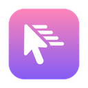
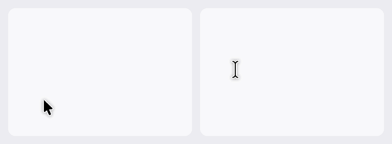
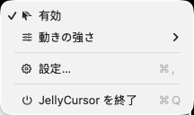
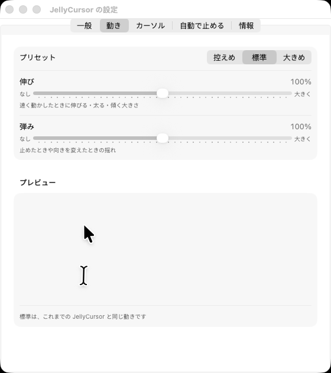

# JellyCursor

動かすと伸びて、止めると揺れて戻る macOS のマウスカーソル。メニューバーに常駐します。



<sub>アプリと同じ動きの計算（`JellyCursorCore`）で描いたもの。左が矢印、右が文字の上の I 字。灰色の輪はボタンを押している間（`docs/motion-gif/make.sh` で作り直せます）</sub>

- **矢印**: 動いた道筋に沿って伸び、進行方向を向く。止めると（ゆっくりしか動かさないときも）振り子のように1回だけ行き過ぎて、左上向きに戻る。左右に振ったときなど道が折り返すと、伸びを縮めて先端のまわりでくるっと向きを変え、振り続けても同じ向きへ回り続けず振り子のように行き来する（少し行き過ぎて戻したくらいでは向きを変えない）。止めた手のふるえでは伸びも曲がりもしない
- **文字の上の I 字**: 横に振ると太く、縦に振ると伸び、斜めに振るとその向きに傾く
- **リンクの上の指**: 矢印と同じく進行方向を指差して伸び、止めると上向きに戻る
- **クリック**: 押すとクリック位置へ向けて少しつぶれ、離すと弾んで戻る（矢印・I 字・指のどれも。クリック位置は動かない）。トラックパッドの短いタップでも弾む。押したまま動かす（ドラッグ）と、ふつうの動きに戻る

それ以外のカーソル（リサイズなど）、システムのダイアログの上、ほかのアプリがカーソルを隠している間（動画・文字入力）は、macOS の本物のカーソルのまま表示します。

## 動作環境

- macOS 14 以降（macOS 26 で確認）
- 作るには Swift 6 が要ります。Xcode は無くてもよく、Command Line Tools（`xcode-select --install`）で作れます

## 作り方

```sh
make app       # JellyCursor.app を作る
make run       # 作って開く
make install   # ~/Applications に入れる（ログイン時の起動を使うときはこちら）
make test      # 試験を回す
```

## 使い方

メニューバーのアイコンから操作します。アイコンは状態で変わります（動いている・オフ・一時停止中は薄く・本物のカーソルを隠せないときは警告）。

| メニュー | |
| --- | --- |
| 有効 | オン・オフ。ショートカットを決めていれば、文字か数字のキーのときは横に出ます |
| 「〇〇」では無効 | 直前に使っていたアプリ（JellyCursor 以外）を、使っている間は止めるアプリに加える・外す |
| 動きの強さ | 控えめ・標準・大きめ |
| 本物のカーソルに戻す | オフにして、本物のカーソルを確実に表示する |
| 設定…（⌘,） | 設定画面を開く |



### 設定画面



- **一般**: 有効、ログイン時に起動、メニューバーのアイコン、オン・オフのショートカット（⌘・⌃・⌥のうち2つ以上との組み合わせか、ファンクションキー）、初期状態に戻す
- **動き**: プリセットと「伸び」「弾み」の強さ（どちらも 100% が標準）、クリックで弾むか。プレビューで動きを確かめられます
- **カーソル**: 矢印・I 字・指を、種類ごとにオン・オフ
- **自動で止める**: 「視差効果を減らす」がオンのとき（初期値オン）、低電力モードのとき（初期値オン）、全画面のアプリを使っているとき（初期値オフ）、使っている間は止めるアプリ
- **情報**: バージョンと今の状態。「診断情報をコピー」で、おかしな動きを伝えるときの情報をまとめてコピーできます

はじめて起動したときは、案内つきで設定画面が開きます。

画面のロック中、ほかのユーザーに切り替えている間、スクリーンセーバー、スリープの間は、いつも止めて本物のカーソルに戻します。

「視差効果を減らす」を使っている Mac では、初期設定のままだと止まった状態で始まります（メニューに理由が出ます）。動かしたいときは「自動で止める」でこの項目をオフにしてください。

メニューバーのアイコンを隠したときは、JellyCursor をもう一度開くと設定画面が開きます。

## 困ったとき

- **カーソルが見えなくなった**: 決めておいたショートカットでオフにするか、メニューの「本物のカーソルに戻す」を選びます。ターミナルで `killall JellyCursor` を実行しても、本物のカーソルに戻ってから終わります
- **起動するとおかしくなる**: Shift キーを押しながら JellyCursor を開くと、何も隠さずに止めた状態（セーフモード）で起動します。メニューか設定でオンにすると動き始めます
- **設定を消したい**: JellyCursor を終了してから `defaults delete local.jellycursor`（動いている間に消すと、次に設定を変えたときに書き戻されます）
- **動きがおかしい**: 設定の「情報」の「診断情報をコピー」で、設定や画面の情報と、この起動のあいだの最近の記録（状態の変化など30件まで）をまとめてコピーできます。これまでの記録は、ターミナルで `log show --last 1h --predicate 'subsystem == "local.jellycursor"'` を実行すると見られます

## 仕組み

- 画面ごとに、カーソル専用の層に透明な窓を置き、その上に変形させたカーソルの形を描きます（窓はクリックを通し、VoiceOver からも見えません）
- 前面にいないアプリからは公開 API で本物のカーソルを隠せないため、非公開 API（`SetsCursorInBackground`）を使います。使えない macOS では、矢印だけを本物に重ねて描き（I 字と指は本物のまま）、メニューに警告を出します
- マウスが止まっている間は表示リンクを止め、1秒60回のタイマーでマウス位置だけを見ます

## 構成

| モジュール | 中身 |
| --- | --- |
| `JellyCursorCore` | 動きの計算、設定、自動で止めるかの判断など。AppKit を使わないので、Linux でも試験を回せます |
| `JellyCursorKit` | 窓・本物のカーソル・メニュー・設定画面・ショートカット・Mac の状態の見張り |
| `JellyCursor` | 起動だけ |

試験は swift-testing で書いています。`MotionRobustnessTests` は、左右に振る・でたらめに動かす・乱暴な入力（一瞬で向きが変わる、画面の端まで飛ぶ、0 秒や 1/30 秒のフレーム）を、設定の組み合わせ・ポインタの大きさ・画面の書き換えの速さ（60/120/240Hz）を変えて流し、形が自分と重ならない（崩れない）こと、1フレームで大きく飛ばないこと、マウスの近くにあること、止めれば元の形に戻ること、書き換えの速さで動きが変わらないこと、少し行き過ぎて戻したくらいでは向きを変えないこと、どの向きに振ってもプロペラのように回り続けないこと（指も）、円を描き続けても伸びたままでいること、胴体と逆向きへ動き出してもつぶれないこと、角を曲がったあとで尾が跳ねないこと、手のふるえで動かないこと、ポインタが飛んだりフレームが長くなったりしても暴れないことを確かめます。`ClickTests` はクリックの形の変化と、短いタップも見逃さないことを確かめます。`JellyCursorKitTests` は macOS でだけ回り、本物のカーソルの画像の見分け、アイコンの書き出し、設定画面のプレビューなどを確かめます。本物のカーソルの画像は画面につながっていないと読めないので、ssh 越しではなく、ログインしている Mac のターミナルで回してください。`GoldenMotionTests` は、決まったマウスの動きを流したときの形が、記録した値（`Tests/JellyCursorCoreTests/Resources/golden-motion.json`）と一致することを確かめ、意図しない動きの変化に気づけるようにします。動きの標準を意図して変えたときは、`RECORD_GOLDEN=1 swift test --filter GoldenMotionTests` で記録し直してください。

CI（GitHub Actions）は、`JellyCursorCore` を Linux で、アプリ全体を macOS で、警告をエラーとして作って試験します。
main 以外のブランチへの push で、いちばん新しいコミットのメッセージに `[screenshots]` を含めると、macOS でアプリを実際に起動して、はじめての起動の案内・設定画面の各タブ・メニュー・動かしている間のカーソルを撮り、本物のカーソルの出し入れ・ショートカット・⌘W で閉じたあとの前面・Dock のアイコン・動きのプレビュー・クリックで矢印がつぶれて戻ること・設定のタブにフォーカスの枠が出ないこと・止まっている間と動かしている間の CPU も確かめます（成果物の `screenshots`）。

起動時の `-OpenSettings <タブ>`（general・motion・cursors・autoPause・about）と `-OpenMenu YES` は、画面を撮るための指定です（`open JellyCursor.app --args -OpenSettings motion`）。
